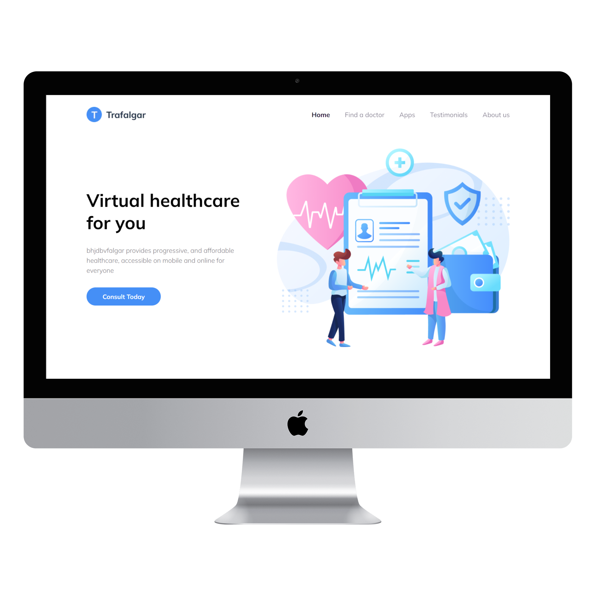

# Landing page for Healthcare Startup

[Live Demo](https://healthcare-design-to-code-nextjs.vercel.app/)

**Wireframe** -
https://www.figma.com/file/EWmzcVkd7qbP5Nf7iMvuqP/Trafalgar-Landing-Page

## Previews

-   **Mobile** -
    

-   **Desktop**
    

I tried my hands on frontend development and converting figma wireframes to code.
I used [embla carousel](https://www.embla-carousel.com/) in testimnoial section and got to learn about it.

## Developing in your system

```bash
npm install
npm run dev
# or
yarn dev
```
